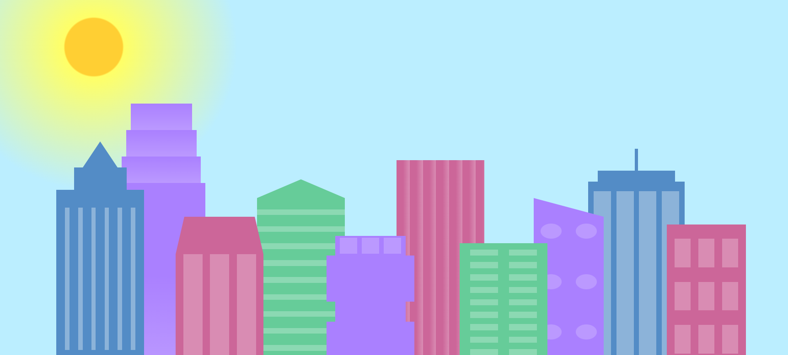

# Building and Sky Animation

This project is a **Building and Sky Animation** that creates a dynamic cityscape with customizable buildings and a responsive sky. Built using HTML and CSS, it includes multiple building designs, window patterns, and changes to the sky based on the screen size.

## **Screenshot**

## **Features**

- Dynamic cityscape with multiple building designs and window patterns.
- Responsive sky that changes to a daylight effect when the screen width is below 1000px.
- Customizable building and window colors using CSS variables.
- Lightweight and modern styling with smooth transitions.

## **Technologies Used**

- HTML5
- CSS3 (with custom properties and media queries)

## **How to Use**

1. Clone or download this repository.
2. Open `index.html` in any modern web browser.
3. Customize the building and window colors by editing the CSS variables in `:root`.

## **License**

This project is licensed under the MIT License - see the LICENSE file for details.

## **Contributing**

Feel free to fork this repository, make improvements, and submit a pull request. Contributions are welcome!
